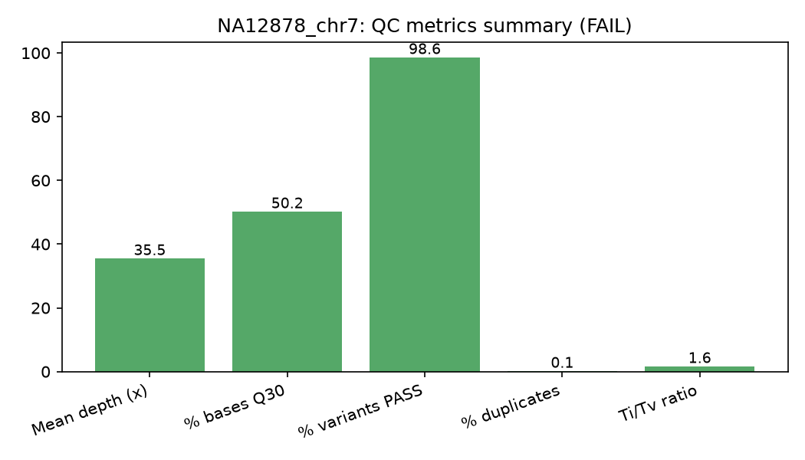
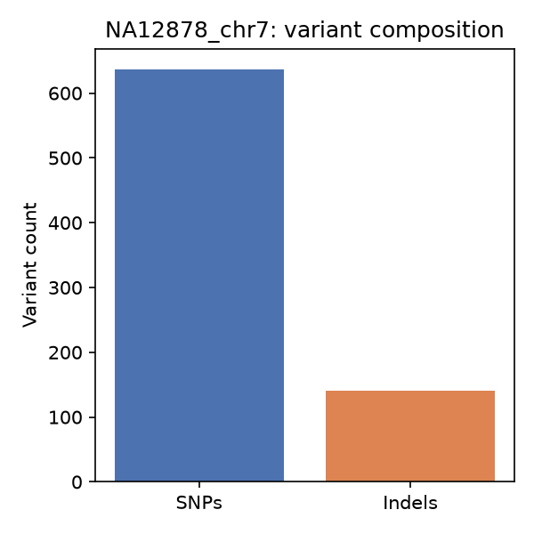

# NGS Variant-Calling QC Pipeline

A lightweight Nextflow pipeline that takes raw FASTQ reads through alignment, variant calling, and automated QC reporting — modeled on the kind of production QC/validation workflow used in clinical NGS testing (e.g. carrier screening panels).

## Overview

This pipeline demonstrates an end-to-end, reproducible NGS analysis workflow:

1. **Raw read QC** — FastQC on input FASTQ files
2. **Alignment** — BWA-MEM alignment to a reference genome slice
3. **Post-processing** — sort, mark duplicates, index (Samtools)
4. **Variant calling** — SNP/indel calling (bcftools mpileup/call)
5. **QC metrics** — depth, Ti/Tv ratio, % variants passing filters (Python + pysam)
6. **Reporting** — metrics loaded into SQLite for querying, visualized with matplotlib, summarized in a written validation report

## Why this pipeline

Production bioinformatics roles in diagnostics and clinical genomics spend as much time on **QC, documentation, and pipeline reliability** as on the analysis itself. This project is scoped to reflect that: it's not just "call some variants," it's call variants, check whether the run should be trusted, and write that judgment down in a form a non-bioinformatics reviewer could read.

## Pipeline diagram

```
FASTQ ─▶ FastQC ─▶ BWA-MEM ─▶ Sort/Dedup/Index ─▶ Variant Calling ─▶ VCF
                                                        │
                                                        ▼
                                          Python QC metrics + SQLite
                                                        │
                                                        ▼
                                          Plots + validation_report.md
```

## Data

- **Input:** 121,325 real Illumina HiSeq 2500 read pairs (2x148bp) for sample **NA12878** (Genome in a Bottle / GIAB reference material HG001), extracted directly from NIST's public `RMNISTHS_30xdownsample.bam` (bwa-mem aligned, GRCh37) restricted to a 1 Mb window on chr7, then converted back to FASTQ — so alignment, duplicate marking, and variant calling in this pipeline are all performed fresh from raw reads.
  - Source: `https://ftp-trace.ncbi.nlm.nih.gov/ReferenceSamples/giab/data/NA12878/NIST_NA12878_HG001_HiSeq_300x/RMNISTHS_30xdownsample.bam`
  - Extraction used htslib's remote range-request support (`samtools view <url> 7:117000000-118000000`), so only the relevant ~55 MB of the 158 GB BAM were downloaded, not the whole file.
- **Reference:** GRCh37/hg19 chr7:117,000,000–118,000,000 (1 Mb slice spanning the CFTR locus), fetched via the UCSC REST API (`api.genome.ucsc.edu`).

## How to run

```bash
nextflow run main.nf \
  --reads 'data/*_R{1,2}.fastq.gz' \
  --ref reference/chr7_slice.fa \
  --outdir results/
```

QC thresholds (mean depth, Q30%, Ti/Tv range, variant pass rate, duplicate rate) are set in [`nextflow.config`](./nextflow.config) and consumed by `scripts/parse_vcf_qc.py`.

## Repository structure

```
.
├── main.nf                  # Nextflow pipeline definition
├── nextflow.config           # QC thresholds + executor config
├── modules/                  # Individual process definitions
│   ├── fastqc.nf
│   ├── align.nf               # BWA_INDEX, FAIDX, ALIGN, MARK_DUPLICATES
│   ├── call_variants.nf       # bcftools mpileup/call + filter
│   └── qc.nf                  # QC_METRICS, PLOT_QC
├── scripts/
│   ├── parse_vcf_qc.py       # Computes depth, Q30%, Ti/Tv, dup rate, pass rate; writes SQLite + JSON
│   └── plot_qc.py            # Generates QC plots from SQLite
├── data/                     # Real NA12878 chr7 FASTQ subset (see Data above)
├── reference/                # chr7 1Mb reference slice (hg19)
├── results/                  # Pipeline outputs (BAM, VCF, qc.db, plots, HTML reports)
├── VALIDATION_REPORT.md      # Written QC/validation summary for this run
└── README.md
```

## Sample QC output




## Validation summary

See [`VALIDATION_REPORT.md`](./VALIDATION_REPORT.md) for the full QC writeup, including thresholds used and pass/fail determination for this run.

## Tools used

Nextflow 26.04 · BWA 0.7.19 · Samtools 1.24 · bcftools 1.24 · FastQC 0.12.1 · Python (pysam, sqlite3, matplotlib)

## What I'd extend next

- Parameterize per-region QC thresholds (e.g. lower depth expectations near low-mappability regions) instead of one flat set of thresholds
- Add a second sample to demonstrate batch/cohort-level QC comparison
- Add BQSR / indel realignment before calling — the Ti/Tv ratio in this run is a direct illustration of why that step matters (see validation report)
- Containerize each process with Docker for full environment reproducibility
